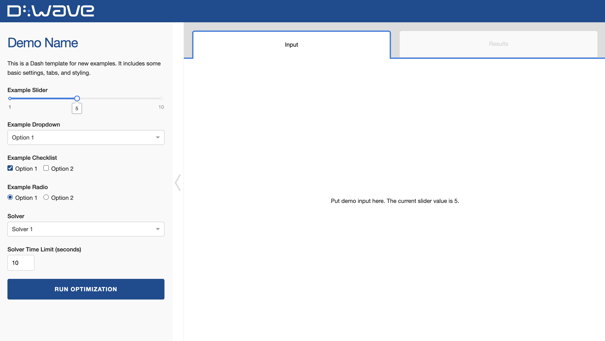

### Interested in contributing a code example?

Please take a look at our [contribution guidelines](CONTRIBUTING.md) before getting started.
Thank you!

The Dash template is intended for demos that would benefit from a user interface. This user
interface could include settings to run and customize the problem, an interactive graphical element,
or tables/charts to compare different solutions. This template is also useful for demos that are
intended for a general audience, as it is more approachable for those without a technical background.

<!-- Before submitting your code, please delete everything above and including this comment. -->
<!-- The following is a README template for your new demo. -->

# Demo Name

Describe your demo and specify what it is demonstrating. Consider the
following questions:

* Is it a canonical problem or a real-world application?
* Does it belong to a particular domain such as material simulation or logistics?
* What level of Ocean proficiency does it target: beginner, advanced?

A clear description allows us to properly categorize your demo.

Please include a screenshot of your demo below.



<!-- Below is boilerplate instructions to be included, as is, in the final demo. -->

## Installation
You can run this example without installation in cloud-based IDEs that support the
[Development Containers specification](https://containers.dev/supporting) (aka "devcontainers")
such as GitHub Codespaces.

For development environments that do not support `devcontainers`, install requirements:

```bash
pip install -r requirements.txt
```

If you are cloning the repo to your local system, working in a
[virtual environment](https://docs.python.org/3/library/venv.html) is recommended.

## Usage
Your development environment should be configured to access the
[Leap&trade; quantum cloud service](https://docs.ocean.dwavesys.com/en/stable/overview/sapi.html).
You can see information about supported IDEs and authorizing access to your Leap account
[here](https://docs.dwavesys.com/docs/latest/doc_leap_dev_env.html).

Run the following terminal command to start the Dash application:

```bash
python app.py
```

Access the user interface with your browser at http://127.0.0.1:8050/.

The demo program opens an interface where you can configure problems and submit these problems to
a solver.

Configuration options can be found in the [demo_configs.py](demo_configs.py) file.

> [!NOTE]\
> If you plan on editing any files while the application is running, please run the application
with the `--debug` command-line argument for live reloads and easier debugging:
`python app.py --debug`

<!-- End of boilerplate. -->

## Problem Description
Give an overview of the problem you are solving in this demo.

**Objectives**: define the goal this example attempts to accomplish by minimizing or maximizing
certain aspects of the problem. For example, a production-line optimization might attempt to
minimize the time to produce all of the products.

**Constraints**: aspects of the problem, with limited or no flexibility, that must be satisfied for
solutions to be considered feasible. For example, a production-line optimization might have a
limitation that Machine A can only bend 10 parts per hour.

## Model Overview
The clearer your model is presented here, the more useful it will be to others. For a strong example
of this section, see [here](https://github.com/dwave-examples/3d-bin-packing#model-overview).

### Parameters
List and define the parameters used in your model.

### Variables
List and define (including type: e.g., "binary" or "integer") the variables solved for in your model.

### Expressions
List and define any combinations of variables used for easier representations of the models.

### Objective
Mathematical formulation of the objective described in the previous section using the listed
parameters, variables, etc.

### Constraints
Mathematical formulation of the constraints described in the previous section using the listed
parameters, variables, etc.

## Code Overview

A general overview of how the code works.

Include any notable parts of the code implementation:

* Talk about unusual or potentially difficult parts of the code
* Explain a code decision
* Explain how parameters were tuned

Note: there is no need to repeat everything that is already well-documented in
the code.

## References

A. Person (YEAR), "An Article Title that Helped Formulate the Problem".
[Link Title](https://example.com/)

## License

Released under the Apache License 2.0. See [LICENSE](LICENSE) file.
